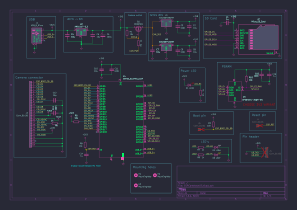

# ESPCameleonV2

# Summary of the project

ESPCameleonV2 is an ESP32 Camera PCB. It resolve the biggest issues of its first version, [ESP32Cameleon](https://github.com/Alan-GIRAUDON/ESPCameleon). This board allow video capture and streaming through WiFi or USB.

## Schematics

## Features

- Micro-USB connector to directly program and power the board
- LDO converters, 3V3 for the ESP32, SD card and LED's, 1V2 and 2V8 for the camera
- RESET plated hole to reset the ESP32 and BOOT plated hole to activate the ESP32 USB boot mode
- FPC connector 24 pins for the camera (tested OV2640, should support OV5640 despite voltage difference)
- Micro-SD card reader to store videos
- White and yellow LED's for debugging and status indicating, red power LED
- Pin header to expose the ESP32 UART interface, the 3V3 rails and GND
- External 8MB PSRAM

## Differences with ESPCameleon

- Added external PSRAM, from 4MB internal PSRAM to 8MB external PSRAM
- Remapped the camera pins to increase the number of parallel lines from 7 to 9
- Removed the additional GPIOS on the header to gain space
- Remapped the SD card to not interfere with the PSRAM
- Replaced the BOOT and RESET button with plated holes to save space
- Removed 1 mounting hole to save space
- Reduced the board size to put the antenna out of the board
- Reorganized traces and components to fit the reduced area
- Updated the silkscreen
## PCB caracteristics

The PCB is a two layer board with single-sided assembly, the thinnest trace is 0.1562 mm and the vias have a 0.7 mm diameter ring and a 0.3 mm hole. The USB traces are as short and as thick as possible to be as close as possible to the 90 $\Omega$ impedance of the JLCPCB two-layer board stackup.

## Board results :

Currently, the board hasn't been produced and rested.

## Programming

The board can be "easily" programmed with both ESP-IDF and Arduino IDE but the later is much faster to get working.

For the arduino IDE, you just need to download the ESP32 boards configurations. Select board "ESP32S2 Dev module", enable "USB CDC on boot", "upload mode" as "internal USB". For the camera webserver example (File->Example->ESP32->Camera->CameraWebServer), you should set "PSRAM" as "enabled", enter your Wifi credentials and update the camera_pins.h to match the board (an example is given in my CameraWebServer2 repository).

An example of streaming through the USB port is available in the USBCameraStreaming repository. It contains an Arduino script to send JPEG images via USB and a Basic Flutter android app to receive and display the video stream.

## Current Issues and TO DO list

- The board needs to be tested to identify possibles issues
- By default, ESP32S2 modules uses SPI pins that aren't exposed to link the PSRAM, whether it is functional with other pins remain to be tested.
